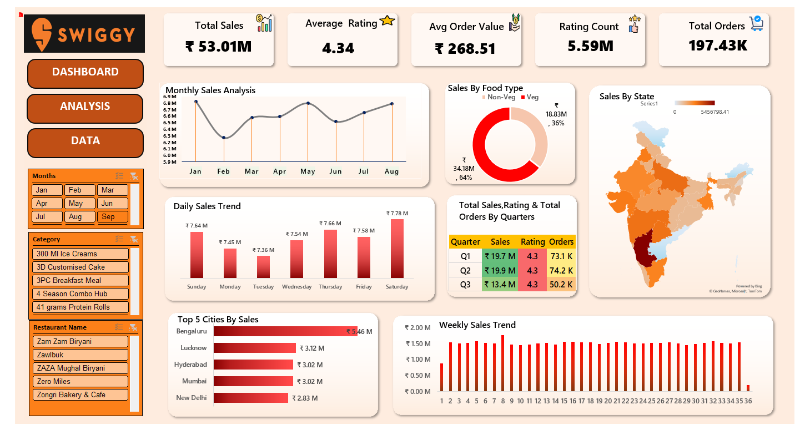

# 📊 Swiggy Sales Dashboard (Excel)

## 📌 Project Overview
This project presents an interactive Excel dashboard built to analyze Swiggy’s sales performance and customer behavior. The dashboard consolidates key business metrics and visual insights to support data-driven decision making.

---

## 🎯 Objectives
- Track overall sales and order performance  
- Analyze customer ratings and average order value  
- Identify sales trends across time, cities, and states  
- Compare performance by food type and quarters  

---

## 📈 Key Metrics (KPIs)
- Total Sales: ₹53.01M  
- Total Orders: 197.43K  
- Average Rating: 4.34  
- Average Order Value: ₹268.51  
- Rating Count: 5.59M  

---

## 📊 Dashboard Features
- Monthly, weekly, and daily sales trends  
- Top 5 cities by sales performance  
- State-wise sales analysis using map visualization  
- Food type comparison (Veg vs Non-Veg)  
- Quarter-wise sales, ratings, and order analysis  
- Interactive slicers for:
  - Month  
  - Category  
  - Restaurant  

---

## 🛠 Tools & Technologies
- Microsoft Excel  
- Pivot Tables  
- Pivot Charts  
- Slicers  
- Conditional Formatting  
- Data Visualization Techniques  

---

## 📂 Repository Structure
📁 swiggy-sales-dashboard  
│── Dashboard.xlsx  
│── dashboard.png  
│── README.md  

---

## 🧠 Key Insights
- Sales peak during weekends compared to weekdays  
- Bengaluru leads in total sales among all cities  
- Non-Veg food contributes a higher share of revenue  
- Q2 recorded the highest sales and order volume  

---

## 🚀 Use Cases
- Business performance monitoring  
- Sales and marketing analysis  
- Executive-level reporting  
- Portfolio project for Data Analyst / Business Analyst roles  

---

## 📸 Dashboard Preview

---

## 📬 Contact
Feel free to connect for feedback, collaboration, or discussion on data analytics projects.

